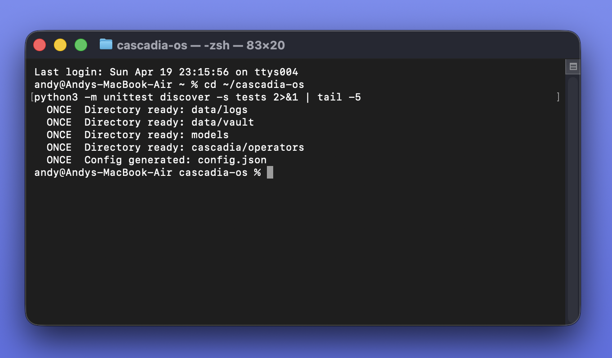

# Cascadia OS

> **The execution layer for AI operators that actually finish the work.**

---

I was five years old the first time I took apart a telephone. Not for school. Because I needed to understand how the sound got through the wire.

Decades later — aerospace engineering in Moscow, automation projects for Amazon and the US Navy, building at 2am while my daughter slept — I kept running into the same problem: AI that was impressive in demos and unreliable in production.

I didn't want a chatbot. I wanted an operator I could trust. Something that remembers, asks before acting, and picks up where it left off after a crash. Something designed for the moment when things go wrong at three in the morning and nobody is watching.

**That's what this is.** → [Full story](./STORY.md)

---

## See it working

**One-click install — done in under a minute:**


**Watchdog running — all 11 components healthy:**


**PRISM dashboard — live system status:**


**Crash recovery — 21/21 tests passed:**


---

## One-Click Install

**Mac / Linux:**
```bash
curl -fsSL https://raw.githubusercontent.com/Zyrconlabs/cascadia-os/main/install.sh | bash
```

**Windows** — in PowerShell:
```powershell
irm https://raw.githubusercontent.com/Zyrconlabs/cascadia-os/main/install.bat -OutFile install.bat; .\install.bat
```

> **Requires:** Python 3.11+ and git

---

## Manual Start

```bash
# First-time setup (opens browser wizard at http://127.0.0.1:4010)
python -m cascadia.installer.once

# Terminal-only setup
python -m cascadia.installer.once --no-browser

# Start the OS
python -m cascadia.kernel.watchdog --config config.json

# Run all tests
python -m unittest discover -s tests -v
```

---

## What it does

Cascadia OS coordinates AI operators that:

- **Remember** — context, decisions, and state persist across sessions and crashes
- **Ask** — approval gates block risky actions until a human says yes
- **Never duplicate** — idempotency enforced at the database layer, not by hope
- **Recover** — resume from the last committed step, not from scratch
- **Run supervised** — FLINT watches every process; the watchdog watches FLINT

---

## What is working right now (v0.31)

### Control plane
| Module | What it does |
|---|---|
| FLINT `kernel/flint.py` | Process supervision, tiered startup, health polling, restart/backoff, graceful shutdown |
| Watchdog `kernel/watchdog.py` | External FLINT liveness monitor — lives outside the supervision tree |

### Installer
| Module | What it does |
|---|---|
| ONCE `installer/once.py` | Browser setup wizard, RAM/GPU/Ollama detection, AI model config, directory init |
| setup.html `installer/setup.html` | 4-step browser UI: system scan → model selection → config editor → launch |

### Durability layer
| Module | What it does |
|---|---|
| run_store | Durable run records with process_state + run_state split |
| step_journal | Append-only step log — source of truth for resume |
| resume_manager | Safe resume-point calculation from committed steps |
| idempotency | SHA-256 keyed side effect records, UNIQUE DB constraint |
| migration | Idempotent schema migration, handles legacy DB upgrades |

### Policy and approvals
| Module | What it does |
|---|---|
| runtime_policy | allow / deny / approval_required per action type |
| approval_store | Persists approval requests and decisions, wakes blocked runs |
| dependency_manager | Detects missing operators and permissions, writes blocked state |

### Named components
| Name | Path | What it does |
|---|---|---|
| CREW | `registry/crew.py` | Operator group registry with wildcard capability validation |
| VAULT | `memory/vault.py` | Durable SQLite-backed memory, capability-gated |
| SENTINEL | `security/sentinel.py` | Risk classification: low / medium / high / critical per action |
| CURTAIN | `encryption/curtain.py` | HMAC-SHA256 envelope signing and field encryption |
| BEACON | `orchestrator/beacon.py` | Capability-checked routing and operator handoffs |
| STITCH | `automation/stitch.py` | Workflow sequencing with built-in templates |
| VANGUARD | `gateway/vanguard.py` | Inbound channel normalization, outbound dispatch |
| HANDSHAKE | `bridge/handshake.py` | External API connection registry |
| BELL | `chat/bell.py` | Chat sessions and approval response collection |
| ALMANAC | `guide/almanac.py` | Component catalog, glossary (26 terms), runbooks |
| PRISM | `dashboard/prism.py` | Live dashboard at `localhost:6300/` — runs, approvals, blocked, crew |

### Operators (v0.31 — new)
| Name | Port | What it does |
|---|---|---|
| SCOUT | `operators/scout/` · `7000` | Inbound lead capture — streaming chat, session history, AI + regex lead extraction, hot/warm/cold scoring, estimated deal value |
| RECON | `operators/recon/` · `7001` | Outbound research agent — task.md-driven queries, CSV output, deduplication, live SSE dashboard |

---

## SCOUT operator

SCOUT is an AI-powered lead capture agent. Embed the chat widget on any website — it qualifies visitors, extracts contact details, and scores leads automatically.

```bash
# Install Scout dependencies
cd cascadia/operators/scout
pip install -r requirements.txt

# Start Scout
python scout_server.py

# Chat widget
open http://localhost:7000/bell

# Embeddable doorbell (iframe)
open http://localhost:7000/doorbell

# Lead pipeline
GET http://localhost:7000/api/leads
GET http://localhost:7000/api/stats
```

Scout uses a 3-folder persona system — swap the markdown files to change its personality without touching code:

```
scouts/lead-engine/
  job_description/role.md      ← who Scout is
  company_policy/policy.md     ← what Scout can and cannot say
  current_task/task.md         ← what Scout is focused on right now
```

---

## RECON operator

RECON is an outbound research agent. Give it a task via `tasks/current/task.md` and it searches, deduplicates, scores, and outputs structured CSV.

```bash
# Install Recon dependencies
cd cascadia/operators/recon
pip install -r requirements.txt

# Start Recon worker + dashboard
python recon_worker.py &
python dashboard.py

# Live research dashboard
open http://localhost:7001/
```

---

## PRISM dashboard

```bash
open http://127.0.0.1:6300/

GET  http://127.0.0.1:6300/api/prism/overview
GET  http://127.0.0.1:6300/api/prism/runs
GET  http://127.0.0.1:6300/api/prism/approvals
GET  http://127.0.0.1:6300/api/prism/blocked
GET  http://127.0.0.1:6300/api/prism/crew
GET  http://127.0.0.1:6300/api/prism/sentinel
GET  http://127.0.0.1:4011/health
```

---

## Port reference

| Port | Band | Component |
|---|---|---|
| 4010 | 4xxx — kernel | ONCE setup wizard (install time only) |
| 4011 | 4xxx — kernel | FLINT status API |
| 5100 | 5xxx — foundation | CREW |
| 5101 | 5xxx — foundation | VAULT |
| 5102 | 5xxx — foundation | SENTINEL |
| 5103 | 5xxx — foundation | CURTAIN |
| 6200 | 6xxx — runtime | BEACON |
| 6201 | 6xxx — runtime | STITCH |
| 6202 | 6xxx — runtime | VANGUARD |
| 6203 | 6xxx — runtime | HANDSHAKE |
| 6204 | 6xxx — runtime | BELL |
| 6205 | 6xxx — runtime | ALMANAC |
| 6300 | 6xxx — visibility | PRISM (dashboard UI + API) |
| 7000 | 7xxx — operators | SCOUT |
| 7001 | 7xxx — operators | RECON |
| 7002+ | 7xxx — operators | future operators |
| 8200+ | 8xxx — expansion | GRID, DEPOT (roadmap) |

---

## Reliability guarantees

| Scenario | Behavior |
|---|---|
| Kill operator mid-run | Resumes from last committed step, not step 0 |
| Crash after side effect committed | Skips the effect — never duplicates |
| Approval-required run restarted | Stays `waiting_human`, never auto-resumes |
| Multiple crashes in sequence | `retry_count` increments correctly each time |

---

## What is partial in v0.31

- **SENTINEL** — risk rules work; enforcement hooks into the full operator loop are v0.32
- **CURTAIN** — HMAC signing works; AES-256-GCM and asymmetric key exchange are v0.32
- **HANDSHAKE** — connection registry works; actual HTTP execution to external APIs is v0.32
- **VANGUARD** — normalization works; dynamic operator discovery and real channel adapters are v0.32
- **PRISM** — aggregation queries work; real-time WebSocket push is v0.32

---

## Roadmap

### v0.32
- VANGUARD dynamic operator discovery (scan_operators pattern)
- SENTINEL enforcement wired end-to-end
- CURTAIN AES-256-GCM + asymmetric key exchange
- HANDSHAKE HTTP execution to external APIs
- PRISM WebSocket real-time push
- BELL persona routing (operator-specific system prompts)
- Model switcher in PRISM

### v0.4+
- GRID — decentralized compute network
- DEPOT — operator marketplace
- Scheduler and trigger manager
- MicroVM operator isolation
- Multi-node HA

---

## Design rules

1. FLINT supervises. FLINT does not execute workflows.
2. No side effect executes twice. Idempotency is enforced at the DB layer.
3. Resume reads the journal. Resume does not guess.
4. Dangerous actions require policy clearance. Policy is separate from capability.
5. Blocking a run is explicit. Auto-resuming a blocked run is never allowed.
6. The module that owns execution does not own policy. The module that owns policy does not own storage.

---

## Docs

- [Manual](./MANUAL.md)
- [Changelog](./CHANGELOG.md)
- [Contributing](./CONTRIBUTING.md)
- [Security Policy](./SECURITY.md)
- [Support](./SUPPORT.md)
- [Story behind the project](./STORY.md)

---

*Built in Houston, Texas — [Zyrcon Labs](https://zyrconlabs.com)*
